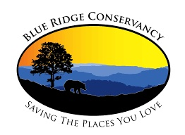

### Drew Wilson 
wilsondj5@appstate.edu
# Expertise
Proficiency in ArcGIS Pro, ArcMap, and ENVI as well as interest in human and physical geography
# Education
Senior geography major at Appalachian State University in Boone, NC. Graduating in Spring 2022 with a concentration in GIS

# Work Experience
Spring 2022 Internship with the [Blue Ridge Conservancy](https://blueridgeconservancy.org) 

